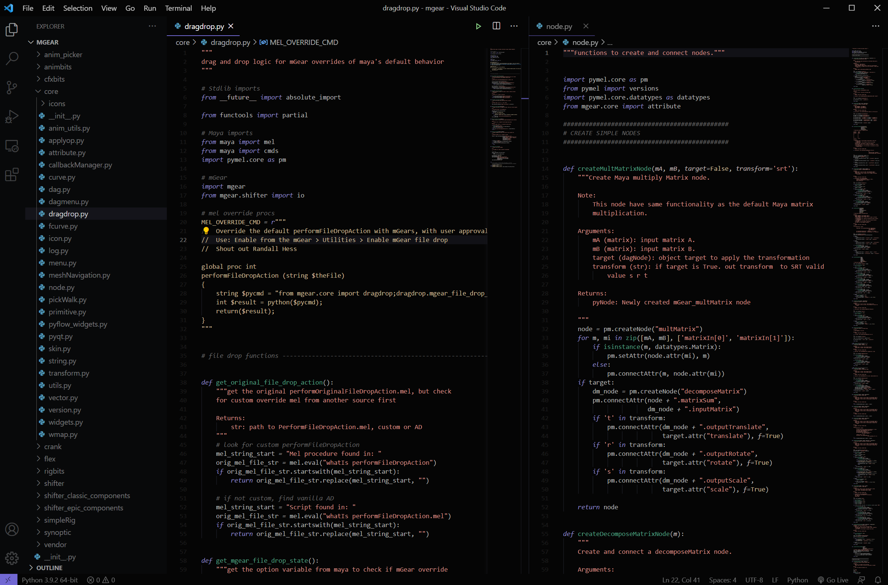

# Korvo Theme for VS Code
This extension for Visual Stuido Code adds themes titled "Korvo"
## Main Pallet

## Korvo Dark Theme


# Installation

1. Open **Extensions** sidebar panel in VS Code. `View → Extensions`
2. Search for `Korvo Theme`.
3. Click **Install** to install it.
4. Code > Preferences > Color Theme > **Korvo Theme**
5. Optional: Use the recommended settings below for best experience
6. Enjoy!

## Recommended Settings
```js 
{
    // Set themme
    "workbench.colorTheme": "Korvo",
    "editor.fontFamily": "Operator Mono, Menlo, Monaco, 'Courier New', monospace",
    "editor.fontSize": 13,
}
```

## License
[MIT](LICENSE)
